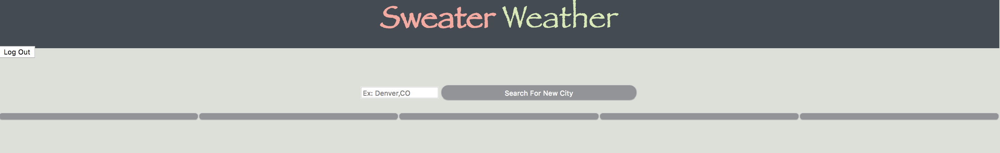
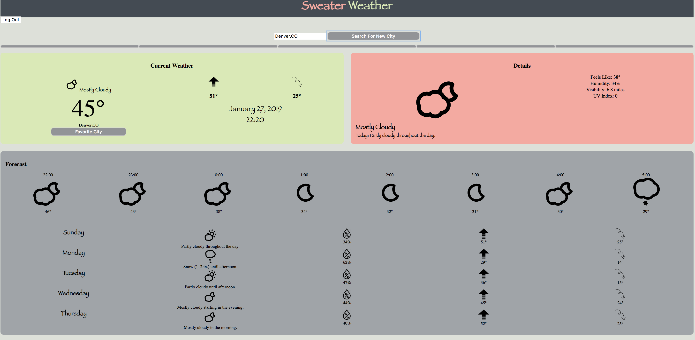
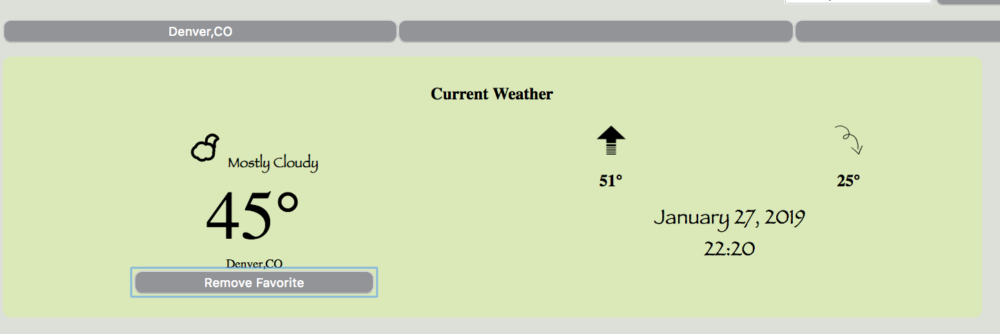

# Sweater Weather Front End
https://mstang15.github.io/sweater_weather_fe/

This application is written in javascript and it dogfoods the Sweater Weather API that was built on Ruby on Rails. 
You can find the backend here: https://github.com/mstang15/sweater_weather

<h1>App Overview</h1>

<h2>Wireframe</h2>

<h2>color palette</h2>
https://coolors.co/424b54-dce0d9-d6ebb2-ffa69e-9fa4a9

When a user visits the app, they are taken to a screen that allows them to log in (for now it is a default log in). Once the user is logged in, they can see any loaded favorites. If it is their first time on the app, there will appear to be no favorites, such as in the picture below. The app only allows users to favorite up to five cities. 

)

After a user either selects their favorite or types in a new city, the weather data is displayed. On the page, the user can see current weather, both short and detailed. They can also see the forecast for the next 8 hours and the following 5 days. 

A user is able to favorite and remove favorites from the app. Once a user adds a favorite, it is displayed in the favorite bar. A user can click on the favorites in the favorite bar to change the content of their screen. 

## Built With
<ul>
JavaScript
jQuery
Express
Mocha
Chai
CSS
HTML
AJAX
sweater_weather API (https://github.com/mstang15/sweater_weather) 
</ul>

## Developer
Meghan Stang
github: mstang15

